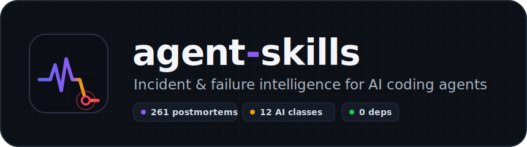

<p align="center">
  
</p>

<p align="center">
  <a href="https://github.com/anmolg1997/prepostmortem-skills/actions/workflows/ci.yml"></a>
  
  
  
  
  
</p>

<p align="center"><b>Your outage has happened before. This tells your agent how it went last time, and what they wish they had done.</b></p>

Two [Claude Code](https://claude.com/claude-code) skills that turn the hard-won lessons of real production failures into something an agent can actually use: a searchable, tagged corpus of **261 real-world postmortems** and a **12-class failure model for agentic-AI systems**, driven by nested subagent workflows for precedent lookup, pre-mortems, design review, and postmortem writing.

No autonomous-RCA theater. Frontier agents solve ~11% of open RCA benchmarks, so these skills do the opposite: they make **you** faster with cited precedent instead of confident guesses.

---

## Why it exists

Postmortems are a graveyard of expensive lessons that nobody reads twice. Meanwhile, the failure modes repeat, the same DNS cascade, the same config rollback that made things worse, the same agent that deleted prod because a prompt said "please don't." Generic LLM advice ("add monitoring, be careful") knows none of this history. Commercial incident tools see only your telemetry, never the public record, and never your code.

**(pre·post)mortem** closes that gap. It is grounded, cited, and lives in your repo.

## What is inside

| Skill | What it does |
|---|---|
| **[postmortem-analyst](postmortem-analyst/)** | Incident precedent and failure-pattern analysis over 261 tagged postmortems (Google, AWS, Cloudflare, GitHub, GitLab, Facebook, NASA, and more). Plus the workflows incident tooling skips: **pre-mortems / FMEA** grounded in precedent, **rubric-based postmortem review**, methodology-driven **postmortem writing** (Google SRE / Howie / Etsy / Cook), and **cross-incident pattern mining** over your own team's postmortems. |
| **[ai-incident-analyst](ai-incident-analyst/)** | Failure analysis for **AI / LLM / agentic systems** over a curated corpus of canonical incidents (Replit's agent deleting a prod database, Anthropic's silent quality-degradation postmortem, EchoLeak zero-click prompt injection, GPT-4o sycophancy rollback). A 12-class failure vocabulary that mirrors SRE taxonomies, plus **agentic pre-mortem / design review** (MAST + OWASP LLM Top-10) and AI-incident postmortem discipline. |

The two cross-delegate: an AI service inherits every classic infrastructure failure mode *and* the twelve agentic ones.

## 30-second quickstart

```
/plugin marketplace add anmolg1997/prepostmortem-skills
/plugin install postmortem-analyst@prepostmortem-skills
/plugin install ai-incident-analyst@prepostmortem-skills
```

Then just describe your situation. Or drive the corpus directly:

```console
$ python3 postmortem-analyst/scripts/pm.py search --cause dns-bgp --blast global-outage

facebook  (config-errors)  Facebook
  cause=config-change,dns-bgp,cascading-failure  blast=global-outage,prolonged-recovery
  Configuration changes to Facebook's backbone routers caused a global outage of all
  Facebook properties and internal tools.
  LESSON: The safety tooling that audits dangerous commands is itself critical-path
  code, and recovery access must not depend on the network being repaired.
  https://engineering.fb.com/2021/10/05/networking-traffic/outage-details/
```

```console
$ python3 ai-incident-analyst/scripts/ai.py search --class prompt-injection

echoleak-copilot  [prompt-injection+excessive-agency]  Microsoft (2025-06)
  EchoLeak (CVE-2025-32711): zero-click data exfiltration from Microsoft 365 Copilot
  LESSON: Anything RAG can retrieve is a potential instruction channel. Agent context
  must enforce trust boundaries between retrieved content and instructions, because the
  user never even has to click.
  https://www.aim.security/lp/aim-labs-echoleak-blogpost
```

## What makes it different

|  | Generic LLM advice | Commercial AI-SRE tools | **(pre·post)mortem** |
|---|:---:|:---:|:---:|
| Grounded in real incidents | no | partial (yours only) | **261 + curated AI corpus** |
| Every claim cites precedent | no | rarely | **yes, by incident id + URL** |
| Pre-mortem *before* you ship | no | no | **yes** |
| Agentic-AI failure coverage | vague | no | **12-class model + MAST + OWASP** |
| Sees your repo, code, configs | no | no | **yes, runs in Claude Code** |
| Runtime cost | - | $$$/seat | **free, 0 deps** |
| Honest about autonomy limits | no | markets 90% RCA | **assists, does not bluff** |

## How it works

Analysis runs **nested**, so it scales without drowning your context:

```
        search the index            fan out one reader              synthesize with
   L0   (seconds, no fetch)   L1     agent per matched        L2     cited precedent
        cheap + precise             incident, in parallel            + a checklist
```

A cheap tagged-index search finds the right incidents; subagents deep-read only those in parallel; a final pass synthesizes the shared mechanism, the remediations that recur across incidents (those are the ones that generalize), and an action checklist for your case. Everything is stdlib Python plus `curl`, with archive.org fallbacks baked in for dead links.

## Install

**As Claude Code plugins** (recommended), see the quickstart above.

**Or clone and symlink** into your skills directory:

```bash
git clone https://github.com/anmolg1997/prepostmortem-skills ~/prepostmortem-skills
ln -s ~/prepostmortem-skills/postmortem-analyst   ~/.claude/skills/postmortem-analyst
ln -s ~/prepostmortem-skills/ai-incident-analyst  ~/.claude/skills/ai-incident-analyst
```

Claude Code discovers each skill automatically. Update with `git -C ~/prepostmortem-skills pull`.

## Layout

```
<skill-name>/
  SKILL.md          entry point: frontmatter + nested workflows
  data/             tagged, machine-readable incident corpus
  references/       failure taxonomy + methodology, loaded on demand
  scripts/          the search / show / fetch CLI the skill drives
```

## References

Public work that helped bring this to life. Thanks to the people behind:

1. [danluu/post-mortems](https://github.com/danluu/post-mortems) and the AWS Post-Event Summaries, for the infrastructure incident record.
2. The [AI Incident Database](https://incidentdatabase.ai), AVID, and public security disclosures, for the AI incident record.
3. The Google SRE Book, the Howie guide, Etsy's debriefing guide, and Richard Cook, for postmortem methodology.
4. Berkeley's MAST taxonomy and the OWASP LLM Top-10, for the agentic failure model.

Each incident links to its original source, whose content belongs to its publisher. The tags, lessons, taxonomies, tooling, and workflows here are our own.

## Contributing

Contributions are welcome, especially new well-documented incidents. See [CONTRIBUTING.md](CONTRIBUTING.md) for the schema and style, and [good first issues](https://github.com/anmolg1997/prepostmortem-skills/labels/good%20first%20issue) to start.

## License

[Apache-2.0](LICENSE). Original work (taxonomies, tags, lessons, tooling, workflows) is ours; linked incident content belongs to its publishers. See [NOTICE](NOTICE).

